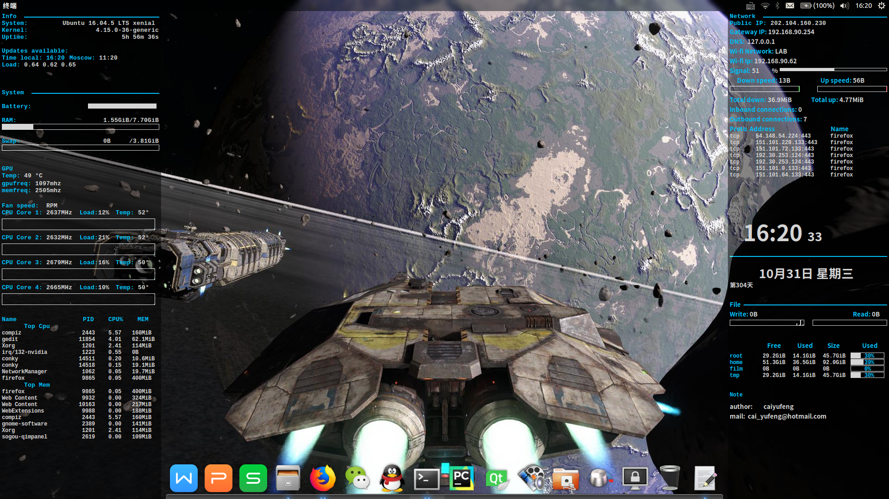

## Conky configuration


## Installation
- Clone repo `git clone https://github.com/alexbel/conky.git ~/.conky`
- Install dependencies (see below)
- Install the necessary ruby gems (see below)
- Rename secrets.yml.example to secrets.yml and put your data in it
- Run 'ruby starter.rb' or just './starter.rb'

## Autostart
Kde plasma 5:  
Create a file `conky.desktop` in `~/.config/autostart` directory and fill it in with the following contents:  
```
[Desktop Entry]
Name=conky
Exec=cd ~/.conky && ruby starter.rb
Type=Application
Terminal=false
```

### Conky versions
- Use `master` branch for conky >= 1.10.0
- Use `1.9` branch for conky <= 1.9.1

### Dependencies
Required:  
  - curl
  - ss
  - acpi
  - sensors

Conky libs:  
  - conky-imlib2


### Install gems
- go to the conky folder (i.e. ~/.conky)
- `gem install bundler`
- `bundle install`
# coolerconky2.0
